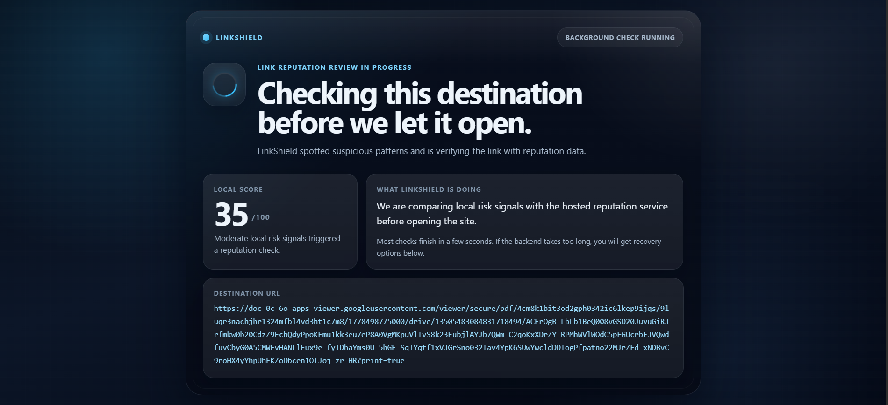
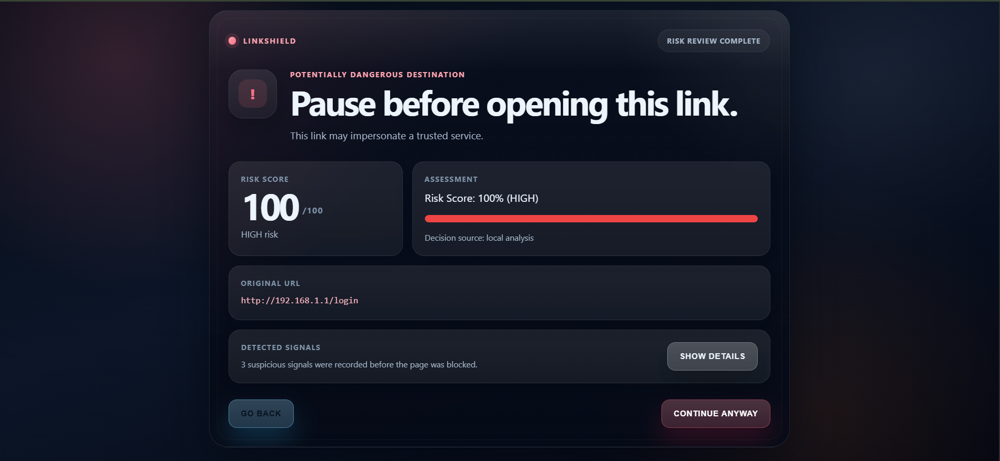

# LinkShield

LinkShield is a Chrome extension that checks risky URLs before they open.

### Scan Screen

### Warning Screen

## Current flow

- Score `< 30`: open directly
- Score `30-69`: verify with the hosted reputation service
- Score `>= 70`: show the warning page immediately
- Safe reputation results are cached for 24 hours to avoid repeated scans

## Quick use 

You can use LinkShield directly from this repo.

1. Download or clone the project
2. Open `chrome://extensions`
3. Turn on `Developer mode`
4. Click `Load unpacked`
5. Select the project folder

The extension is already configured to use the hosted backend, so no extra setup is needed just to try it.

## Notes

- The extension UI and local heuristic analysis run in Chrome
- Medium-risk URLs are checked with the hosted reputation service
- If the hosted check is unavailable, LinkShield falls back to the safer warning path

## Security note

This repo does not require you to add any API key just to try the extension.